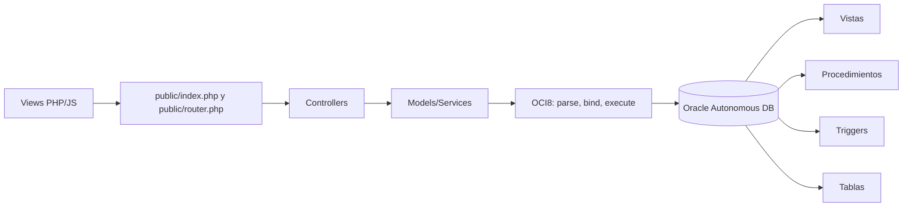
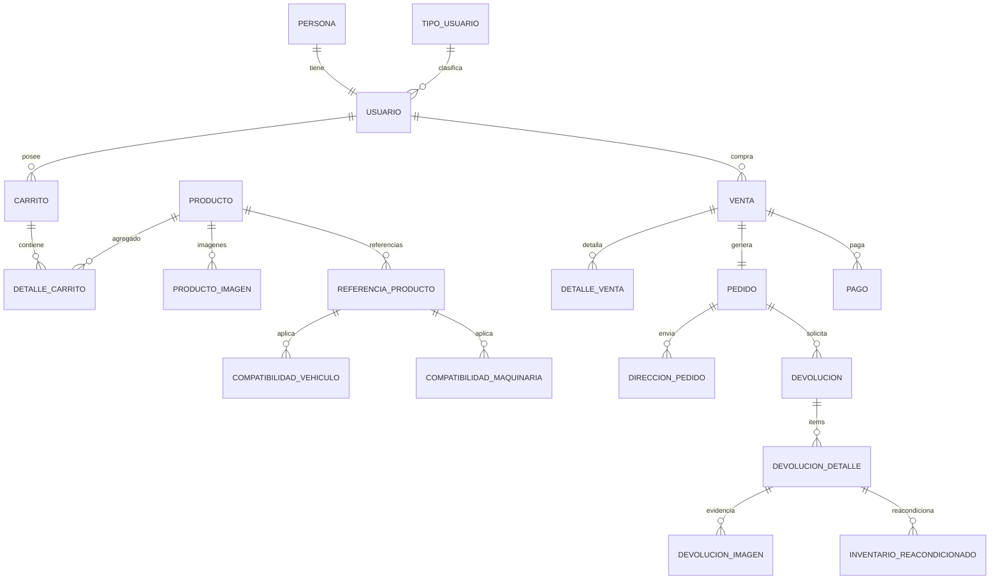

# Documentacion tecnica Oracle, PL/SQL y OCI8

Proyecto: Tienda virtual Nailex Store  
Fecha de analisis: 2026-05-17  
Alcance: scripts `sql/`, modelos PHP, controladores, servicios, configuracion OCI8 y referencias SQL/PLSQL del repositorio.

## Resumen ejecutivo

El proyecto usa una arquitectura PHP MVC con Oracle como motor transaccional principal. La capa PHP se comunica con Oracle mediante OCI8 (`oci_parse`, `oci_bind_by_name`, `oci_execute`, `oci_commit`, `oci_rollback`) y delega reglas criticas de negocio a objetos PL/SQL: secuencias para generacion de IDs, triggers para defaults y sincronizacion automatica, funciones para validaciones y totales, vistas para lectura optimizada y procedimientos almacenados para operaciones de usuario, carrito, pedidos, pagos, direcciones, devoluciones y reacondicionados.

No se encontraron `PACKAGE` PL/SQL definidos en el repositorio. Los cursores son mayormente cursores implicitos (`SELECT INTO`, `FOR UPDATE`, `SQL%ROWCOUNT`) y consultas ejecutadas desde PHP mediante OCI8. Las colecciones PL/SQL aparecen en triggers compuestos con tablas indexadas (`TYPE ... IS TABLE OF ... INDEX BY PLS_INTEGER`) para resolver reglas de unico predeterminado sin error de tabla mutante.

## Arquitectura Oracle + PHP MVC



Flujo general:

1. El usuario interactua con vistas como tienda, carrito, checkout, pedidos, perfil, pagos o devoluciones.
2. `public/index.php` enruta la accion hacia un controlador.
3. El controlador valida sesion/entrada y llama a un modelo o servicio.
4. El modelo prepara SQL o PL/SQL con `oci_parse`.
5. Los parametros se enlazan con `oci_bind_by_name`, evitando concatenar datos sensibles.
6. `oci_execute` ejecuta la consulta; en flujos atomicos se usa `OCI_NO_AUTO_COMMIT`.
7. Si todo sale bien, PHP hace `oci_commit`; ante error, `oci_rollback`.
8. Oracle ejecuta triggers, constraints, vistas, funciones y procedimientos segun corresponda.

## Comunicacion PHP con Oracle mediante OCI8

| Elemento | Ubicacion | Funcion |
|---|---:|---|
| `Database::getConnection()` | `config/database.php:7` | Construye la conexion Oracle, incluyendo wallet/TNS en despliegue. |
| `OCI8Wrapper::query/execute/scalar` | `config/OCI8Wrapper.php:13-84` | Encapsula `oci_parse`, binds por nombre, `oci_execute`, fetch y liberacion de statement. |
| `oci_parse` | multiples modelos/controladores | Prepara SQL, consultas a vistas o bloques `BEGIN SP_... END;`. |
| `oci_bind_by_name` | multiples modelos/controladores | Enlaza parametros de entrada/salida, incluyendo `SQLT_INT`. |
| `oci_execute` | multiples modelos/controladores | Ejecuta consultas. En operaciones multi-paso se usa `OCI_NO_AUTO_COMMIT`. |
| `oci_commit/oci_rollback` | carrito, checkout, pedidos, devoluciones, metodos de pago | Control transaccional desde PHP. |

Patron tipico de llamada a procedimiento:

```php
$stmt = oci_parse($conn, "BEGIN SP_CANCELAR_PEDIDO(:id_pedido, :id_usuario); END;");
oci_bind_by_name($stmt, ':id_pedido', $idPedido, -1, SQLT_INT);
oci_bind_by_name($stmt, ':id_usuario', $idUsuario, -1, SQLT_INT);
oci_execute($stmt, OCI_NO_AUTO_COMMIT);
oci_commit($conn);
```

## Diagrama de dominio principal



## Tabla resumen de objetos PL/SQL y Oracle

| Nombre exacto | Tipo | Ubicacion principal | Modulo dependiente | Impacto |
|---|---|---:|---|---|
| `SEQ_PERSONA`, `SEQ_USUARIO`, `SEQ_CLIENTE`, `SEQ_PRODUCTO`, `SEQ_PRODUCTO_IMAGEN`, `SEQ_CARRITO`, `SEQ_DETALLE_CARRITO`, `SEQ_DIRECCION_USUARIO`, `SEQ_DIRECCION_PEDIDO`, `SEQ_VENTA`, `SEQ_DETALLE_VENTA`, `SEQ_PEDIDO`, `SEQ_PAGO`, `SEQ_PASSWORD_RESETS`, `SEQ_METODO_PAGO_USUARIO` | Sequence | `sql/oracle_db_objects_complemento.sql:22-36` | todos los CRUD | IDs |
| `SEQ_REFERENCIA_PRODUCTO`, `SEQ_COMPATIBILIDAD_VEHICULO`, `SEQ_COMPATIBILIDAD_MAQUINARIA` | Sequence | `sql/referencia_compat_sequences.sql:6-20` | productos/compatibilidad | inventario |
| `SEQ_ENTREGA_PEDIDO` | Sequence | `sql/repartidor_entrega.sql:33` | reparto | pedidos |
| `SEQ_NOTIFICACION` | Sequence | `sql/notificaciones.sql:7` | notificaciones | usuarios/pedidos |
| `SEQ_DEVOLUCION`, `SEQ_DEVOLUCION_DETALLE`, `SEQ_DEVOLUCION_IMAGEN` | Sequence usada desde PHP | `models/DevolucionModel.php:260,286,308` | devoluciones | devoluciones |
| `SEQ_REACONDICIONADO` | Sequence usada por PL/SQL | `sql/refactor_reacondicionados.sql:74` | reacondicionados | inventario |
| `TRG_PERSONA_BI` | Trigger | `sql/oracle_db_objects_complemento.sql:44` | registro/perfil | usuarios |
| `TRG_USUARIO_BI` | Trigger | `sql/oracle_db_objects_complemento.sql:57` | login/registro | usuarios |
| `TRG_USUARIO_AI_CLIENTE` | Trigger | `sql/oracle_db_objects_complemento.sql:70` | registro cliente | usuarios |
| `TRG_CLIENTE_BI` | Trigger | `sql/oracle_db_objects_complemento.sql:89` | clientes | usuarios |
| `TRG_PRODUCTO_BI`, `TRG_PRODUCTO_BU` | Trigger | `sql/oracle_db_objects_complemento.sql:101,113` | admin productos | inventario |
| `TRG_PRODUCTO_IMAGEN_BI`, `TRG_PRODUCTO_IMAGEN_ID` | Trigger | `sql/oracle_db_objects_complemento.sql:123`, `sql/oracle_objetos_faltantes_cloud.sql:24` | imagenes producto | inventario |
| `TRG_CARRITO_BI`, `TRG_DETALLE_CARRITO_BI`, `TRG_DETALLE_CARRITO_BU` | Trigger | `sql/oracle_db_objects_complemento.sql:135,145,161` | carrito | pedidos/inventario |
| `TRG_DIRECCION_USUARIO_BI`, `TRG_DIRECCION_UNICA_PREDET` | Trigger | `sql/oracle_db_objects_complemento.sql:173,188` | perfil/checkout | usuarios/pedidos |
| `TRG_DIRECCION_PEDIDO_BI`, `TRG_DIRECCION_PEDIDO_BU` | Trigger | `sql/oracle_db_objects_complemento.sql:219,232` | checkout/pedido | pedidos |
| `TRG_VENTA_BI`, `TRG_DETALLE_VENTA_BI` | Trigger | `sql/oracle_db_objects_complemento.sql:240,256` | checkout | pagos/pedidos |
| `TRG_PEDIDO_BI` | Trigger | `sql/oracle_db_objects_complemento.sql:278` | pedidos | pedidos |
| `TRG_PAGO_BI`, `TRG_PAGO_AI_ESTADO_PEDIDO` | Trigger | `sql/oracle_db_objects_complemento.sql:290,303`; version produccion en `sql/fix_produccion_webhook.sql:256` | Wompi/pagos | pagos/pedidos |
| `TRG_PASSWORD_RESETS_BI` | Trigger | `sql/oracle_db_objects_complemento.sql:321` | recuperacion | usuarios |
| `TRG_MPU_BI`, `TRG_MPU_UNICO_PREDET` | Trigger | `sql/metodos_pago_usuario.sql:138,157` | metodos de pago | pagos/usuarios |
| `FN_TOTAL_CARRITO`, `FN_TOTAL_VENTA` | Function | `sql/oracle_db_objects_complemento.sql:338,357` | carrito/venta | pagos |
| `FN_USUARIO_EXISTE`, `FN_CORREO_EXISTE`, `FN_TELEFONO_EXISTE` | Function | `sql/oracle_db_objects_complemento.sql:372,385,398`; version extendida en `sql/oracle_objetos_faltantes_cloud.sql:42,57,74` | registro/perfil | usuarios |
| `FN_PEDIDO_PUEDE_CANCELARSE` | Function | `sql/oracle_db_objects_complemento.sql:411`; version con usuario en `sql/oracle_objetos_faltantes_cloud.sql:94` | pedidos | pedidos |
| `FN_DIRECCION_PREDETERMINADA` | Function | `sql/oracle_db_objects_complemento.sql:425`; version robusta en `sql/oracle_objetos_faltantes_cloud.sql:113` | checkout/perfil | usuarios/pedidos |
| `FN_TARJETA_VENCIDA` | Function | `sql/oracle_objetos_faltantes_cloud.sql:134` | metodos de pago | pagos |
| `FN_METODO_PREDETERMINADO` | Function | `sql/metodos_pago_usuario.sql:445` | checkout/pagos | pagos |
| `V_USUARIO_COMPLETO` | View | `sql/oracle_db_objects_complemento.sql:448` | `models/UsuarioModel.php:249` | usuarios |
| `V_PRODUCTOS_ADMIN` | View | `sql/oracle_db_objects_complemento.sql:466`; `sql/oracle_objetos_faltantes_cloud.sql:154` | admin productos | inventario |
| `V_CARRITO_USUARIO` | View | `sql/oracle_db_objects_complemento.sql:487` | `models/CarritoModel.php:172,269,397,433` | carrito |
| `V_DIRECCIONES_USUARIO` | View | `sql/oracle_db_objects_complemento.sql:504`; `sql/oracle_objetos_faltantes_cloud.sql:176` | `models/DireccionPedidoModel.php:164,200` | usuarios/pedidos |
| `V_DETALLE_PEDIDO` | View | `sql/oracle_db_objects_complemento.sql:521` | pedidos | pedidos |
| `V_ADMIN_PEDIDOS` | View | `sql/oracle_db_objects_complemento.sql:544`; `sql/oracle_objetos_faltantes_cloud.sql:285` | `models/AdminPedidoModel.php:28` | pedidos/admin |
| `V_PAGOS_PEDIDO` | View | `sql/oracle_objetos_faltantes_cloud.sql:193` | pagos/factura | pagos |
| `V_FACTURA_PEDIDO` | View | `sql/oracle_objetos_faltantes_cloud.sql:209` | `Controllers/PedidoController.php:635` | pedidos/pagos |
| `V_PEDIDOS_USUARIO` | View | `sql/fix_produccion_webhook.sql:282`; `sql/flujo_pagos_pedidos.sql:306` | pedidos usuario | pedidos/pagos |
| `V_METODOS_PAGO_USUARIO` | View | `sql/metodos_pago_usuario.sql:189` | `models/MetodoPagoUsuarioModel.php` | pagos |
| `V_COMPATIBILIDADES_VEHICULO`, `V_COMPATIBILIDADES_MAQUINARIA` | View | `sql/v_compatibilidades_vehiculo.sql:1`, `sql/v_compatibilidades_maquinaria.sql:1` | `models/ProductoModel.php:745,763,833,1280,1351` | inventario |
| `V_DEVOLUCIONES_ADMIN` | View | `sql/v_devoluciones_admin.sql:4` | admin devoluciones | devoluciones |
| `V_OFERTAS_REACONDICIONADOS`, `V_STOCK_MUERTO` | View | `sql/refactor_reacondicionados.sql:87,101` | `models/DevolucionModel.php:562,587` | devoluciones/inventario |
| `SP_REGISTRAR_USUARIO` | Procedure | `sql/oracle_objetos_faltantes_cloud.sql:327` | registro | usuarios |
| `SP_ACTUALIZAR_PERFIL`, `SP_CAMBIAR_PASSWORD`, `SP_GENERAR_TOKEN_RECUPERACION`, `SP_MARCAR_TOKEN_USADO` | Procedure | `sql/oracle_objetos_faltantes_cloud.sql:388,422,438,458` | perfil/recuperacion | usuarios |
| `SP_CREAR_PRODUCTO`, `SP_ACTUALIZAR_PRODUCTO`, `SP_ELIMINAR_PRODUCTO`, `SP_GUARDAR_IMAGEN_PRODUCTO`, `SP_ELIMINAR_IMAGEN_PRODUCTO` | Procedure | `sql/oracle_objetos_faltantes_cloud.sql:473,503,529,546,565` | admin productos | inventario |
| `SP_AGREGAR_CARRITO`, `SP_ACTUALIZAR_CARRITO`, `SP_ELIMINAR_CARRITO`, `SP_VACIAR_CARRITO` | Procedure | `sql/oracle_db_objects_complemento.sql:667,720,741,760` | `models/CarritoModel.php:87,114,137,208` | carrito |
| `SP_GUARDAR_DIRECCION_USUARIO`, `SP_ACTUALIZAR_DIRECCION_USUARIO`, `SP_ELIMINAR_DIRECCION_USUARIO`, `SP_ACTUALIZAR_DIRECCION_PEDIDO` | Procedure | `sql/oracle_objetos_faltantes_cloud.sql:583,645,685,724` | `models/DireccionPedidoModel.php:226,300,354,471` | usuarios/pedidos |
| `SP_CANCELAR_PEDIDO`, `SP_EXPIRAR_PEDIDOS` | Procedure | `sql/oracle_db_objects_complemento.sql:778,810`; produccion `sql/fix_produccion_webhook.sql:58` | `Controllers/PedidoController.php:1192`, `models/PedidoLifecycleModel.php:12` | pedidos/pagos |
| `PC_CREAR_VENTA`, `PC_INSERTAR_DETALLE_VENTA` | Procedure | `sql/flujo_pagos_pedidos.sql:34,71` | `models/VentaModel.php:135` | pagos/pedidos |
| `SP_PROCESAR_PAGO` | Procedure | `sql/fix_produccion_webhook.sql:86`; version previa `sql/flujo_pagos_pedidos.sql:117` | `models/WompiModel.php:273` | pagos/pedidos/inventario |
| `SP_GUARDAR_METODO_PAGO`, `SP_ACTUALIZAR_METODO_PAGO`, `SP_ELIMINAR_METODO_PAGO`, `SP_PREDETERMINAR_METODO_PAGO` | Procedure | `sql/metodos_pago_usuario.sql:299,373,403,422` | `models/MetodoPagoUsuarioModel.php:412,641,532,677` | pagos |
| `SP_APROBAR_DEVOLUCION`, `SP_RECHAZAR_DEVOLUCION`, `SP_PRODUCTO_RECIBIDO` | Procedure | `sql/fix_devoluciones_sp.sql:7,36`; `sql/refactor_reacondicionados.sql:7` | `models/DevolucionModel.php:393,401,409` | devoluciones/inventario |
| `SP_CREAR_PEDIDO_COMPLETO` | Procedure externo esperado | usado en `models/PedidoModel.php:189,205` | checkout | pedidos/pagos |
| `SP_DESCONTAR_STOCK` | Procedure externo opcional | invocado dinamicamente en `sql/fix_produccion_webhook.sql:209-213` | pagos | inventario |

## Objetos documentados

# Secuencias de IDs base

## Tipo
Secuencias Oracle.

## Ubicacion
`sql/oracle_db_objects_complemento.sql:22-36`, `sql/referencia_compat_sequences.sql:6-20`, `sql/repartidor_entrega.sql:33`, `sql/notificaciones.sql:7`, uso adicional en `models/DevolucionModel.php:260,286,308`.

## Descripcion tecnica
Generan valores numericos incrementales para llaves primarias. Se crean de forma idempotente consultando `USER_SEQUENCES` o capturando `SQLCODE = -955`.

## Funcionamiento
Los triggers `BEFORE INSERT` consumen `NEXTVAL` cuando el ID llega nulo. Algunos modelos tambien insertan explicitamente `SEQ_*.NEXTVAL`.

## Relacion con el sistema
Evitan depender de autoincrementos no disponibles como en MySQL/PostgreSQL. Soportan usuarios, productos, carrito, pedidos, pagos, direcciones, notificaciones, compatibilidades, devoluciones y reacondicionados.

## Flujo
PHP inserta sin ID o con `SEQ_*.NEXTVAL`; Oracle asigna el identificador; PHP recupera valores con `RETURNING ... INTO` cuando necesita continuar el flujo.

## Tablas involucradas
`PERSONA`, `USUARIO`, `CLIENTE`, `PRODUCTO`, `PRODUCTO_IMAGEN`, `CARRITO`, `DETALLE_CARRITO`, `DIRECCION_USUARIO`, `DIRECCION_PEDIDO`, `VENTA`, `DETALLE_VENTA`, `PEDIDO`, `PAGO`, `PASSWORD_RESETS`, `METODO_PAGO_USUARIO`, `REFERENCIA_PRODUCTO`, `COMPATIBILIDAD_VEHICULO`, `COMPATIBILIDAD_MAQUINARIA`, `ENTREGA_PEDIDO`, `NOTIFICACION`, `DEVOLUCION`, `DEVOLUCION_DETALLE`, `DEVOLUCION_IMAGEN`, `INVENTARIO_REACONDICIONADO`.

## Importancia dentro del proyecto
Son la base de integridad referencial y trazabilidad. Riesgo: si una secuencia falta, fallan inserts; por eso hay scripts idempotentes y modelos que verifican disponibilidad.

# Triggers de usuarios y personas

## Tipo
Triggers `BEFORE INSERT` y `AFTER INSERT`.

## Ubicacion
`TRG_PERSONA_BI` (`sql/oracle_db_objects_complemento.sql:44`), `TRG_USUARIO_BI` (`:57`), `TRG_USUARIO_AI_CLIENTE` (`:70`), `TRG_CLIENTE_BI` (`:89`), `TRG_PASSWORD_RESETS_BI` (`:321`).

## Descripcion tecnica
Normalizan correo, telefono y username; asignan IDs; definen estado por defecto; crean registro `CLIENTE` automatico para usuarios tipo cliente; inicializan tokens de recuperacion.

## Funcionamiento
`TRG_PERSONA_BI` convierte correo a minuscula y limpia telefono con `REGEXP_REPLACE`. `TRG_USUARIO_BI` normaliza usuario y estado. `TRG_USUARIO_AI_CLIENTE` inserta en `CLIENTE` si `ID_TIPO = 3`. `TRG_PASSWORD_RESETS_BI` define vencimiento y bandera `USED`.

## Relacion con el sistema
Se relacionan con registro, login, recuperacion de clave y perfil.

## Flujo
Registro crea `PERSONA` y `USUARIO`; triggers asignan IDs y normalizan; si es cliente, se crea `CLIENTE`; recuperacion inserta token y trigger define expiracion.

## Tablas involucradas
`PERSONA`, `USUARIO`, `CLIENTE`, `PASSWORD_RESETS`, `TIPO_USUARIO`.

## Importancia dentro del proyecto
Garantizan consistencia de usuarios. Riesgos: duplicados deben validarse tambien con funciones/constraints; limpiar telefono cambia el formato visible.

# Triggers de producto, carrito, venta, pedido y pago

## Tipo
Triggers `BEFORE INSERT`, `BEFORE UPDATE`, `AFTER INSERT OR UPDATE`.

## Ubicacion
`TRG_PRODUCTO_BI` `:101`, `TRG_PRODUCTO_BU` `:113`, `TRG_PRODUCTO_IMAGEN_BI` `:123`, `TRG_CARRITO_BI` `:135`, `TRG_DETALLE_CARRITO_BI` `:145`, `TRG_DETALLE_CARRITO_BU` `:161`, `TRG_VENTA_BI` `:240`, `TRG_DETALLE_VENTA_BI` `:256`, `TRG_PEDIDO_BI` `:278`, `TRG_PAGO_BI` `:290`, `TRG_PAGO_AI_ESTADO_PEDIDO` `:303` y version produccion `sql/fix_produccion_webhook.sql:256`.

## Descripcion tecnica
Asignan IDs, defaults, validan cantidades/precios, calculan subtotales, definen estado inicial de pedidos/pagos y sincronizan pedido cuando pago queda aprobado.

## Funcionamiento
`TRG_DETALLE_VENTA_BI` consulta `PRODUCTO` para precio/nombre y calcula `SUBTOTAL`. `TRG_PAGO_AI_ESTADO_PEDIDO` actualiza `PEDIDO.ID_ESTADO = 2` si el pago queda `APPROVED` o equivalente con transaccion real. La version de produccion respeta `CANCELADO_AUTOMATICO`, reactivando solo pedidos cancelados por timeout.

## Relacion con el sistema
Checkout, carrito, pagos Wompi, pedidos de usuario y administracion.

## Flujo
Producto se agrega al carrito; detalle valida cantidad; checkout crea venta/detalles/pedido; pago se registra; trigger sincroniza estado del pedido automaticamente.

## Tablas involucradas
`PRODUCTO`, `PRODUCTO_IMAGEN`, `CARRITO`, `DETALLE_CARRITO`, `VENTA`, `DETALLE_VENTA`, `PEDIDO`, `PAGO`, `ESTADO_PEDIDO`.

## Importancia dentro del proyecto
Concentran reglas automaticas que evitan inconsistencias entre venta, pago y pedido. Riesgo clave: triggers de pago duplican parte de la logica de `SP_PROCESAR_PAGO`, por lo que las versiones deben mantenerse alineadas.

# Triggers de direcciones y metodos predeterminados

## Tipo
Triggers simples y compound triggers con colecciones PL/SQL.

## Ubicacion
`TRG_DIRECCION_USUARIO_BI` (`sql/oracle_db_objects_complemento.sql:173`), `TRG_DIRECCION_UNICA_PREDET` (`:188`), `TRG_DIRECCION_PEDIDO_BI` (`:219`), `TRG_DIRECCION_PEDIDO_BU` (`:232`), `TRG_MPU_BI` (`sql/metodos_pago_usuario.sql:138`), `TRG_MPU_UNICO_PREDET` (`:157`).

## Descripcion tecnica
Garantizan una unica direccion predeterminada por usuario y un unico metodo de pago predeterminado activo. Usan colecciones PL/SQL (`TYPE t_ids`, `TYPE t_users`) en triggers compuestos para acumular filas afectadas y actualizar despues del statement.

## Funcionamiento
Cuando una fila se marca como predeterminada, el trigger almacena su usuario e ID; al terminar la sentencia, desmarca las demas filas de ese usuario.

## Relacion con el sistema
Perfil, checkout, libreta de direcciones y metodos de pago guardados.

## Flujo
Usuario crea o edita una direccion/tarjeta; procedimiento o PHP marca predeterminado; trigger desmarca otros registros.

## Tablas involucradas
`DIRECCION_USUARIO`, `DIRECCION_PEDIDO`, `METODO_PAGO_USUARIO`.

## Importancia dentro del proyecto
Resuelve consistencia de preferencias. Optimizacion: compound trigger evita mutating table y reduce errores al manejar varias filas.

# Funciones de validacion de usuario

## Tipo
Funciones PL/SQL.

## Ubicacion
`FN_USUARIO_EXISTE`, `FN_CORREO_EXISTE`, `FN_TELEFONO_EXISTE` en `sql/oracle_db_objects_complemento.sql:372-407`; version extendida con exclusion por persona en `sql/oracle_objetos_faltantes_cloud.sql:42-91`.

## Descripcion tecnica
Reciben username, correo o telefono y retornan `1` si existe, `0` si no existe. Usan `LOWER`, `TRIM`, `REGEXP_REPLACE` y `COUNT(*)`.

## Funcionamiento
Se invocan desde `SP_REGISTRAR_USUARIO` y `SP_ACTUALIZAR_PERFIL` para impedir duplicados.

## Relacion con el sistema
Registro y actualizacion de perfil.

## Flujo
Formulario PHP envia datos; procedimiento valida con funciones; si existe duplicado lanza `RAISE_APPLICATION_ERROR`; PHP captura excepcion y muestra error.

## Tablas involucradas
`USUARIO`, `PERSONA`.

## Importancia dentro del proyecto
Protegen identidad y autenticacion. Riesgo: deben complementarse con constraints `UNIQUE` para evitar carreras concurrentes.

# Funciones de totales y predeterminados

## Tipo
Funciones PL/SQL.

## Ubicacion
`FN_TOTAL_CARRITO` (`sql/oracle_db_objects_complemento.sql:338`), `FN_TOTAL_VENTA` (`:357`, usada en `models/VentaModel.php:389`), `FN_DIRECCION_PREDETERMINADA` (`:425`), `FN_METODO_PREDETERMINADO` (`sql/metodos_pago_usuario.sql:445`), `FN_TARJETA_VENCIDA` (`sql/oracle_objetos_faltantes_cloud.sql:134`), `FN_PEDIDO_PUEDE_CANCELARSE` (`sql/oracle_db_objects_complemento.sql:411`).

## Descripcion tecnica
Calculan totales, buscan IDs predeterminados y validan estado de pedido/tarjeta.

## Funcionamiento
Usan agregaciones (`SUM`), filtros por usuario/estado, `FETCH FIRST 1 ROWS ONLY`, `LAST_DAY`, `TRUNC(SYSDATE)` y manejo `NO_DATA_FOUND`.

## Relacion con el sistema
Carrito, checkout, metodos de pago, cancelacion de pedidos.

## Flujo
PHP solicita total o predeterminado; Oracle calcula con datos vigentes; PHP usa el resultado en UI o en decision de negocio.

## Tablas involucradas
`CARRITO`, `DETALLE_CARRITO`, `PRODUCTO`, `DETALLE_VENTA`, `DIRECCION_USUARIO`, `METODO_PAGO_USUARIO`, `PEDIDO`, `VENTA`.

## Importancia dentro del proyecto
Centralizan calculos sensibles. Riesgo: el total de venta debe coincidir con el snapshot guardado en `VENTA` y `DETALLE_VENTA`.

# Vistas de usuarios, productos, carrito y direcciones

## Tipo
Views.

## Ubicacion
`V_USUARIO_COMPLETO` (`sql/oracle_db_objects_complemento.sql:448`), `V_PRODUCTOS_ADMIN` (`:466`), `V_CARRITO_USUARIO` (`:487`), `V_DIRECCIONES_USUARIO` (`:504`).

## Descripcion tecnica
Componen datos de varias tablas para lectura directa desde modelos. Incluyen joins y calculos de subtotal.

## Funcionamiento
`V_USUARIO_COMPLETO` une `USUARIO`, `PERSONA`, `TIPO_USUARIO`. `V_PRODUCTOS_ADMIN` une productos/categorias y toma primera imagen con `MIN(URL) KEEP (DENSE_RANK FIRST ORDER BY ...)`. `V_CARRITO_USUARIO` calcula `p.PRECIO * dc.CANTIDAD`. `V_DIRECCIONES_USUARIO` normaliza `ES_PREDETERMINADA` con `NVL`.

## Relacion con el sistema
Perfil, admin de productos, carrito y checkout.

## Flujo
Modelos consultan la vista con binds; PHP transforma filas a arrays; controladores renderizan vistas.

## Tablas involucradas
`USUARIO`, `PERSONA`, `TIPO_USUARIO`, `PRODUCTO`, `CATEGORIA_PRODUCTO`, `PRODUCTO_IMAGEN`, `CARRITO`, `DETALLE_CARRITO`, `DIRECCION_USUARIO`.

## Importancia dentro del proyecto
Reducen SQL repetitivo en PHP y estabilizan contratos de lectura.

# Vistas de pedidos, pagos y factura

## Tipo
Views.

## Ubicacion
`V_DETALLE_PEDIDO` (`sql/oracle_db_objects_complemento.sql:521`), `V_ADMIN_PEDIDOS` (`:544` y version `sql/oracle_objetos_faltantes_cloud.sql:285`), `V_PAGOS_PEDIDO` (`sql/oracle_objetos_faltantes_cloud.sql:193`), `V_FACTURA_PEDIDO` (`:209`, usada en `Controllers/PedidoController.php:635`), `V_PEDIDOS_USUARIO` (`sql/fix_produccion_webhook.sql:282`).

## Descripcion tecnica
Unen `PEDIDO`, `VENTA`, `DETALLE_VENTA`, `PAGO`, `METODO_PAGO`, `USUARIO`, `PERSONA`, `ESTADO_PEDIDO` y `DIRECCION_PEDIDO`. Varias usan `CASE WHEN EXISTS` para mostrar "Procesado" cuando hay pago aprobado aunque el estado interno siga pendiente.

## Funcionamiento
Sirven como capa de lectura para historial de pedidos, administracion, factura y estado visible.

## Relacion con el sistema
Mis pedidos, detalle/factura, panel admin y seguimiento.

## Flujo
Pedido se crea en checkout; vistas consolidan datos; controladores consultan por usuario/pedido; UI muestra estado, totales, direccion y cliente.

## Tablas involucradas
`PEDIDO`, `VENTA`, `DETALLE_VENTA`, `PAGO`, `METODO_PAGO`, `USUARIO`, `PERSONA`, `ESTADO_PEDIDO`, `DIRECCION_PEDIDO`.

## Importancia dentro del proyecto
Permiten documentar y auditar el ciclo pedido-pago. Riesgo: usar logica visual de estado en vistas puede ocultar desincronizaciones si triggers/SP fallan.

# Vistas de compatibilidad e inventario especializado

## Tipo
Views.

## Ubicacion
`V_COMPATIBILIDADES_VEHICULO` (`sql/v_compatibilidades_vehiculo.sql:1`), `V_COMPATIBILIDADES_MAQUINARIA` (`sql/v_compatibilidades_maquinaria.sql:1`), `V_OFERTAS_REACONDICIONADOS` (`sql/refactor_reacondicionados.sql:87`), `V_STOCK_MUERTO` (`:101`).

## Descripcion tecnica
Exponen compatibilidades por referencia y productos reacondicionados disponibles o en stock muerto.

## Funcionamiento
Las vistas de compatibilidad unen `PRODUCTO`, `REFERENCIA_PRODUCTO` y tablas de compatibilidad. Las vistas de reacondicionados unen `INVENTARIO_REACONDICIONADO`, `PRODUCTO`, `REFERENCIA_PRODUCTO` y primera imagen por subconsulta.

## Relacion con el sistema
Filtros de tienda, productos, reacondicionados y administracion de devoluciones.

## Flujo
El usuario filtra por vehiculo/maquinaria; `ProductoModel` consulta la vista; admin revisa items reacondicionados o stock muerto desde `DevolucionModel`.

## Tablas involucradas
`PRODUCTO`, `REFERENCIA_PRODUCTO`, `COMPATIBILIDAD_VEHICULO`, `COMPATIBILIDAD_MAQUINARIA`, `INVENTARIO_REACONDICIONADO`, `PRODUCTO_IMAGEN`.

## Importancia dentro del proyecto
Hace consultable una logica de catalogo compleja. Optimizacion: filtra solo productos/referencias activos y usa vistas para no repetir joins.

# Vistas de devoluciones y metodos de pago

## Tipo
Views.

## Ubicacion
`V_DEVOLUCIONES_ADMIN` (`sql/v_devoluciones_admin.sql:4`), `V_METODOS_PAGO_USUARIO` (`sql/metodos_pago_usuario.sql:189`).

## Descripcion tecnica
`V_DEVOLUCIONES_ADMIN` muestra cabecera de devolucion con estado, cliente y datos de reembolso. `V_METODOS_PAGO_USUARIO` muestra tarjetas activas con formato `MM/YYYY`, fuente/token Wompi y predeterminado.

## Funcionamiento
Usan joins a tablas maestras y `NVL`, `TO_CHAR`, `TRIM` para robustez de presentacion.

## Relacion con el sistema
Admin devoluciones, perfil/metodos de pago y checkout.

## Flujo
Admin consulta devoluciones; cliente administra tarjetas; procedimientos modifican datos y vistas muestran solo registros vigentes.

## Tablas involucradas
`DEVOLUCION`, `ESTADO_DEVOLUCION`, `USUARIO`, `PERSONA`, `METODO_PAGO_USUARIO`, `METODO_PAGO`.

## Importancia dentro del proyecto
Separan datos operativos de presentacion y ocultan tarjetas inactivas.

# Procedimientos de usuario y recuperacion

## Tipo
Procedures.

## Ubicacion
`SP_REGISTRAR_USUARIO` (`sql/oracle_objetos_faltantes_cloud.sql:327`), `SP_ACTUALIZAR_PERFIL` (`:388`), `SP_CAMBIAR_PASSWORD` (`:422`), `SP_GENERAR_TOKEN_RECUPERACION` (`:438`), `SP_MARCAR_TOKEN_USADO` (`:458`).

## Descripcion tecnica
Crean usuario/persona, actualizan perfil, cambian password y gestionan tokens. Reciben datos de formulario y retornan IDs o cambian estado.

## Funcionamiento
Validan duplicados con funciones, normalizan texto y telefono, usan `RETURNING ... INTO`, `RAISE_APPLICATION_ERROR` y updates directos.

## Relacion con el sistema
Registro, login, recuperar/restablecer clave y perfil.

## Flujo
Controlador recibe formulario; modelo llama SP; Oracle valida y persiste; PHP confirma o muestra error.

## Tablas involucradas
`PERSONA`, `USUARIO`, `PASSWORD_RESETS`.

## Importancia dentro del proyecto
Concentran reglas de identidad. Riesgo: `SP_REGISTRAR_USUARIO` debe estar sincronizado con triggers y constraints de usuario.

# Procedimientos de productos e imagenes

## Tipo
Procedures.

## Ubicacion
`SP_CREAR_PRODUCTO`, `SP_ACTUALIZAR_PRODUCTO`, `SP_ELIMINAR_PRODUCTO`, `SP_GUARDAR_IMAGEN_PRODUCTO`, `SP_ELIMINAR_IMAGEN_PRODUCTO` en `sql/oracle_objetos_faltantes_cloud.sql:473-565`; versiones base en `sql/oracle_db_objects_complemento.sql:603-655`.

## Descripcion tecnica
CRUD de catalogo e imagenes. Reciben campos de producto/categoria/imagen y devuelven ID en creacion.

## Funcionamiento
Insert/update/delete sobre `PRODUCTO` y `PRODUCTO_IMAGEN`. La validacion de precio negativo se refuerza con `TRG_PRODUCTO_BU`.

## Relacion con el sistema
Panel administrativo de productos y tienda.

## Flujo
Admin crea/edita producto; PHP llama SP o ejecuta SQL directo segun modelo; Oracle asigna ID y mantiene defaults.

## Tablas involucradas
`PRODUCTO`, `PRODUCTO_IMAGEN`, `CATEGORIA_PRODUCTO`.

## Importancia dentro del proyecto
Mantiene catalogo. Riesgo: eliminar producto borra imagenes y puede chocar con ventas historicas si hay FK restrictivas.

# Procedimientos de carrito

## Tipo
Procedures.

## Ubicacion
`SP_AGREGAR_CARRITO` (`sql/oracle_db_objects_complemento.sql:667`, usado `models/CarritoModel.php:87`), `SP_ACTUALIZAR_CARRITO` (`:720`, usado `:114`), `SP_ELIMINAR_CARRITO` (`:741`, usado `:137,232`), `SP_VACIAR_CARRITO` (`:760`, usado `:208`).

## Descripcion tecnica
Gestionan carrito por usuario. Reciben `ID_USUARIO`, `ID_PRODUCTO`, `ID_REFERENCIA` y cantidad.

## Funcionamiento
`SP_AGREGAR_CARRITO` bloquea o crea carrito (`FOR UPDATE`), busca detalle existente y suma cantidad; si no existe inserta. Los otros SP actualizan, eliminan o vacian detalles.

## Relacion con el sistema
Tienda, detalle de producto, carrito y checkout.

## Flujo
Usuario agrega producto; controlador llama modelo; modelo invoca SP en transaccion; vista `V_CARRITO_USUARIO` muestra resumen.

## Tablas involucradas
`CARRITO`, `DETALLE_CARRITO`, `PRODUCTO`.

## Importancia dentro del proyecto
Evita duplicar filas por producto/referencia. Riesgo: validar stock antes de confirmar venta sigue siendo necesario.

# Procedimientos de direcciones

## Tipo
Procedures.

## Ubicacion
`SP_GUARDAR_DIRECCION_USUARIO` (`sql/oracle_objetos_faltantes_cloud.sql:583`, usado `models/DireccionPedidoModel.php:226`), `SP_ACTUALIZAR_DIRECCION_USUARIO` (`:645`, usado `:300`), `SP_ELIMINAR_DIRECCION_USUARIO` (`:685`, usado `:354`), `SP_ACTUALIZAR_DIRECCION_PEDIDO` (`:724`, usado `:471`).

## Descripcion tecnica
CRUD de direcciones del usuario y edicion de direccion congelada del pedido.

## Funcionamiento
Normalizan nombres/telefono, manejan predeterminada, impiden eliminar la unica direccion y solo permiten editar direccion de pedido pendiente.

## Relacion con el sistema
Perfil, checkout y pedidos pendientes.

## Flujo
Cliente administra direcciones; checkout copia una direccion a `DIRECCION_PEDIDO`; si el pedido esta pendiente, puede editarla.

## Tablas involucradas
`DIRECCION_USUARIO`, `DIRECCION_PEDIDO`, `PEDIDO`.

## Importancia dentro del proyecto
Preserva snapshot de envio aunque el usuario luego edite su libreta. Riesgo: validar estado `ID_ESTADO = 1` evita cambios despues de procesamiento.

# Procedimientos de venta, pedido y pago

## Tipo
Procedures.

## Ubicacion
`PC_CREAR_VENTA` (`sql/flujo_pagos_pedidos.sql:34`, usado `models/VentaModel.php:135`), `PC_INSERTAR_DETALLE_VENTA` (`:71`), `SP_CREAR_PEDIDO_COMPLETO` usado en `models/PedidoModel.php:189,205` pero no definido en scripts del repo, `SP_CANCELAR_PEDIDO` (`sql/oracle_objetos_faltantes_cloud.sql:765`, usado `Controllers/PedidoController.php:1192`), `SP_EXPIRAR_PEDIDOS` (`sql/fix_produccion_webhook.sql:58`, usado `models/PedidoLifecycleModel.php:12`), `SP_PROCESAR_PAGO` (`sql/fix_produccion_webhook.sql:86`, usado `models/WompiModel.php:273`).

## Descripcion tecnica
Crean venta/pedido, procesan webhook de Wompi, cancelan o expiran pedidos y sincronizan estados.

## Funcionamiento
`PC_CREAR_VENTA` calcula `TOTAL = subtotal + iva + envio`. `SP_PROCESAR_PAGO` valida venta/estado, bloquea venta y pago con `FOR UPDATE`, inserta o actualiza `PAGO`, evita sobrescribir pagos terminales, llama dinamicamente `SP_DESCONTAR_STOCK` si existe y actualiza pedido a procesado. En produccion, re-activa solo pedidos con `CANCELADO_AUTOMATICO = 1`. `SP_EXPIRAR_PEDIDOS` cancela pendientes sin pago aprobado despues de la ventana configurada.

## Relacion con el sistema
Checkout, Wompi webhook, mis pedidos, admin pedidos, inventario.

## Flujo
Checkout crea venta/detalles/pedido con `OCI_NO_AUTO_COMMIT`; Wompi retorna referencia; webhook llama `SP_PROCESAR_PAGO`; pago aprobado actualiza pedido y descuenta stock; cron llama `SP_EXPIRAR_PEDIDOS` para pendientes vencidos.

## Tablas involucradas
`VENTA`, `DETALLE_VENTA`, `PEDIDO`, `PAGO`, `METODO_PAGO`, `ESTADO_PEDIDO`, tablas de stock usadas por `SP_DESCONTAR_STOCK`.

## Importancia dentro del proyecto
Es el flujo financiero principal. Riesgos: idempotencia de webhooks, no sobrescribir `APPROVED`, diferenciar cancelacion manual vs automatica, y que `SP_DESCONTAR_STOCK` exista/sea correcto.

# Procedimientos de metodos de pago

## Tipo
Procedures.

## Ubicacion
`SP_GUARDAR_METODO_PAGO` (`sql/metodos_pago_usuario.sql:299`, usado `models/MetodoPagoUsuarioModel.php:412`), `SP_ACTUALIZAR_METODO_PAGO` (`:373`, usado `:641`), `SP_ELIMINAR_METODO_PAGO` (`:403`, usado `:532`), `SP_PREDETERMINAR_METODO_PAGO` (`:422`, usado `:677`).

## Descripcion tecnica
Administra tarjetas tokenizadas por Wompi. Recibe usuario, metodo, titular, ultimos 4, franquicia, token/fuente Wompi, expiracion y predeterminado.

## Funcionamiento
Valida usuario, metodo 2/3, franquicia Visa/Mastercard, token/fuente; determina predeterminado si es la primera tarjeta; elimina de forma logica con `ACTIVO = 0` y `ESTADO_WOMPI = 'VOIDED'`.

## Relacion con el sistema
Perfil, checkout y reintentos de pago.

## Flujo
Wompi tokeniza tarjeta; PHP guarda fuente; Oracle valida y persiste; vistas muestran tarjetas activas.

## Tablas involucradas
`METODO_PAGO_USUARIO`, `METODO_PAGO`, `USUARIO`.

## Importancia dentro del proyecto
Evita guardar datos sensibles de tarjeta completa. Riesgo: solo deben guardarse tokens/fuentes, nunca PAN/CVV.

# Procedimientos de devoluciones y reacondicionados

## Tipo
Procedures.

## Ubicacion
`SP_APROBAR_DEVOLUCION` (`sql/fix_devoluciones_sp.sql:7`, usado `models/DevolucionModel.php:393`), `SP_RECHAZAR_DEVOLUCION` (`:36`, usado `:401`), `SP_PRODUCTO_RECIBIDO` (`sql/refactor_reacondicionados.sql:7`, usado `models/DevolucionModel.php:409`).

## Descripcion tecnica
Controlan aprobacion/rechazo de devoluciones y entrada de productos devueltos al inventario reacondicionado.

## Funcionamiento
`SP_APROBAR_DEVOLUCION` cambia cabecera a estado 2, guarda observacion y marca detalles pendientes como `APROBADO`; hace `COMMIT` y `ROLLBACK` interno. `SP_RECHAZAR_DEVOLUCION` marca cabecera estado 3 y detalles `RECHAZADO`. `SP_PRODUCTO_RECIBIDO` marca detalle como recibido, identifica producto/referencia/precio original, crea o actualiza `INVENTARIO_REACONDICIONADO`, y si acumula 3 devoluciones lo mueve a `STOCK_MUERTO`.

## Relacion con el sistema
Modulo de devoluciones cliente/admin, reembolsos y reacondicionados.

## Flujo
Cliente solicita devolucion; admin aprueba/rechaza; al recibir producto se invoca `SP_PRODUCTO_RECIBIDO`; item queda pendiente, ofertable o stock muerto.

## Tablas involucradas
`DEVOLUCION`, `DEVOLUCION_DETALLE`, `DETALLE_VENTA`, `INVENTARIO_REACONDICIONADO`, `PRODUCTO`, `REFERENCIA_PRODUCTO`.

## Importancia dentro del proyecto
Automatiza recuperacion de inventario. Riesgo: estos SP hacen `COMMIT/ROLLBACK` internos, lo que puede romper atomicidad si PHP intenta agrupar varias operaciones en una sola transaccion.

# Objetos externos esperados

## Tipo
Procedures no definidos en scripts del repositorio.

## Ubicacion
`SP_CREAR_PEDIDO_COMPLETO` usado en `models/PedidoModel.php:189,205`; `SP_DESCONTAR_STOCK` invocado dinamicamente en `sql/fix_produccion_webhook.sql:209-213`.

## Descripcion tecnica
El codigo espera que existan en la base. `SP_CREAR_PEDIDO_COMPLETO` crea pedido completo desde checkout con argumentos consultados en `USER_ARGUMENTS`. `SP_DESCONTAR_STOCK` descuenta inventario al aprobar pago.

## Funcionamiento
`PedidoModel` adapta la llamada a los argumentos reales del procedimiento. `SP_PROCESAR_PAGO` consulta `USER_PROCEDURES` y ejecuta `SP_DESCONTAR_STOCK` solo si existe.

## Relacion con el sistema
Checkout, pago aprobado e inventario.

## Flujo
Checkout crea pedido; webhook aprueba; stock se descuenta.

## Tablas involucradas
Inferidas: `VENTA`, `DETALLE_VENTA`, `PEDIDO`, `DIRECCION_PEDIDO`, `PAGO`, `PRODUCTO`, `REFERENCIA_PRODUCTO`, tablas de compatibilidad.

## Importancia dentro del proyecto
Son dependencias criticas fuera del repositorio. Riesgo academico/documental: incluir DDL real de estos objetos desde la base de produccion para cerrar la trazabilidad.

## Tabla de dependencias PHP -> Oracle

| Modulo PHP | Objeto Oracle | Archivo/linea | Dependencia |
|---|---|---:|---|
| `CarritoModel` | `SP_AGREGAR_CARRITO` | `models/CarritoModel.php:87` | Agregar item |
| `CarritoModel` | `SP_ACTUALIZAR_CARRITO` | `models/CarritoModel.php:114` | Cambiar cantidad |
| `CarritoModel` | `SP_ELIMINAR_CARRITO` | `models/CarritoModel.php:137,232` | Eliminar item |
| `CarritoModel` | `SP_VACIAR_CARRITO` | `models/CarritoModel.php:208` | Vaciar carrito |
| `CarritoModel` | `V_CARRITO_USUARIO` | `models/CarritoModel.php:172,269,397,433` | Lectura/resumen |
| `DireccionPedidoModel` | `V_DIRECCIONES_USUARIO` | `models/DireccionPedidoModel.php:164,200` | Listar/obtener direccion |
| `DireccionPedidoModel` | SP de direcciones | `models/DireccionPedidoModel.php:226,300,354,471` | CRUD direccion |
| `VentaModel` | `PC_CREAR_VENTA` | `models/VentaModel.php:135` | Crear venta |
| `VentaModel` | `FN_TOTAL_VENTA` | `models/VentaModel.php:389` | Recalcular total |
| `PedidoModel` | `SP_CREAR_PEDIDO_COMPLETO` | `models/PedidoModel.php:189,205` | Crear pedido completo |
| `PedidoLifecycleModel` | `SP_EXPIRAR_PEDIDOS` | `models/PedidoLifecycleModel.php:12` | Cron expiracion |
| `WompiModel` | `SP_PROCESAR_PAGO` | `models/WompiModel.php:273` | Webhook pago |
| `MetodoPagoUsuarioModel` | SP metodos de pago | `models/MetodoPagoUsuarioModel.php:412,532,641,677` | Tarjetas guardadas |
| `AdminPedidoModel` | `V_ADMIN_PEDIDOS` | `models/AdminPedidoModel.php:28` | Admin pedidos |
| `ProductoModel` | `V_COMPATIBILIDADES_VEHICULO` | `models/ProductoModel.php:745,763,833,1280,1351` | Filtros catalogo |
| `UsuarioModel` | `V_USUARIO_COMPLETO` | `models/UsuarioModel.php:249` | Perfil/usuario completo |
| `DevolucionModel` | SP devoluciones | `models/DevolucionModel.php:393,401,409` | Aprobar/rechazar/recibir |
| `DevolucionModel` | `V_OFERTAS_REACONDICIONADOS`, `V_STOCK_MUERTO` | `models/DevolucionModel.php:562,587` | Reacondicionados |
| `PedidoController` | `V_FACTURA_PEDIDO` | `Controllers/PedidoController.php:635` | Factura |
| `PedidoController` | `SP_CANCELAR_PEDIDO` | `Controllers/PedidoController.php:1192` | Cancelacion |

## Tabla de procedimientos y tablas afectadas

| Procedimiento | Recibe | Devuelve | Tablas |
|---|---|---|---|
| `SP_REGISTRAR_USUARIO` | datos persona, username, password, tipo | `p_id_usuario OUT` | `PERSONA`, `USUARIO`, `CLIENTE` via trigger |
| `SP_ACTUALIZAR_PERFIL` | usuario y datos personales | nada | `USUARIO`, `PERSONA` |
| `SP_CAMBIAR_PASSWORD` | usuario, hash | nada | `USUARIO` |
| `SP_GENERAR_TOKEN_RECUPERACION` | usuario, token | nada | `PASSWORD_RESETS` |
| `SP_CREAR_PRODUCTO` | datos producto | `p_id_producto OUT` | `PRODUCTO` |
| `SP_GUARDAR_IMAGEN_PRODUCTO` | producto, url, orden | nada | `PRODUCTO_IMAGEN` |
| `SP_AGREGAR_CARRITO` | usuario, producto, referencia, cantidad | nada | `CARRITO`, `DETALLE_CARRITO` |
| `SP_GUARDAR_DIRECCION_USUARIO` | usuario y direccion | `p_id_direccion OUT` | `DIRECCION_USUARIO` |
| `PC_CREAR_VENTA` | usuario, subtotal, iva, envio, cliente | `p_id_venta OUT` | `VENTA` |
| `PC_INSERTAR_DETALLE_VENTA` | venta, producto, cantidad | nada | `DETALLE_VENTA`, lee `PRODUCTO` |
| `SP_CANCELAR_PEDIDO` | pedido, usuario | nada | `PEDIDO`, `VENTA` |
| `SP_EXPIRAR_PEDIDOS` | nada | nada | `PEDIDO`, lee `PAGO` |
| `SP_PROCESAR_PAGO` | venta, metodo, estado Wompi, tx/ref/json | nada | `VENTA`, `PAGO`, `PEDIDO`, inventario por `SP_DESCONTAR_STOCK` |
| `SP_GUARDAR_METODO_PAGO` | usuario, metodo, tarjeta tokenizada | nada | `METODO_PAGO_USUARIO` |
| `SP_APROBAR_DEVOLUCION` | devolucion, observacion | nada | `DEVOLUCION`, `DEVOLUCION_DETALLE` |
| `SP_PRODUCTO_RECIBIDO` | detalle devolucion | nada | `DEVOLUCION_DETALLE`, `DETALLE_VENTA`, `INVENTARIO_REACONDICIONADO` |

## Tabla de triggers y momento de ejecucion

| Trigger | Momento | Evento | Efecto |
|---|---|---|---|
| `TRG_PERSONA_BI` | Before each row | Insert persona | ID, correo lower, telefono numerico |
| `TRG_USUARIO_BI` | Before each row | Insert usuario | ID, username lower, estado |
| `TRG_USUARIO_AI_CLIENTE` | After each row | Insert usuario | Crea cliente si tipo 3 |
| `TRG_PRODUCTO_BU` | Before each row | Update producto | Rechaza precio negativo |
| `TRG_DETALLE_CARRITO_BI/BU` | Before each row | Insert/update detalle carrito | ID, seleccionado, cantidad > 0 |
| `TRG_DIRECCION_UNICA_PREDET` | Compound | Insert/update direccion | Unica predeterminada |
| `TRG_DETALLE_VENTA_BI` | Before each row | Insert detalle venta | Precio, nombre, subtotal |
| `TRG_PAGO_AI_ESTADO_PEDIDO` | After each row | Insert/update pago | Pedido procesado si pago aprobado |
| `TRG_MPU_UNICO_PREDET` | Compound | Insert/update metodo pago | Unico metodo predeterminado activo |

## Consultas SQL complejas y funciones Oracle usadas

| Uso | Ubicacion | Tecnicas |
|---|---:|---|
| Primera imagen de producto | `V_PRODUCTOS_ADMIN`, `V_OFERTAS_REACONDICIONADOS`, `DevolucionModel` | `MIN KEEP (DENSE_RANK FIRST)`, subquery con `ORDER BY ... FETCH FIRST 1 ROWS ONLY` |
| Estado visible de pedido | `V_ADMIN_PEDIDOS`, `V_FACTURA_PEDIDO`, `V_PEDIDOS_USUARIO` | `CASE`, `EXISTS`, `UPPER`, `TRIM` |
| Idempotencia pago | `SP_PROCESAR_PAGO` | `FOR UPDATE`, `NO_DATA_FOUND`, `NVL`, condiciones terminales |
| Expiracion pedidos | `SP_EXPIRAR_PEDIDOS` | `SYSTIMESTAMP - INTERVAL`, `CAST`, `NOT EXISTS` |
| Normalizacion usuario | triggers/funciones usuario | `LOWER`, `TRIM`, `REGEXP_REPLACE` |
| Fecha tarjeta | `FN_TARJETA_VENCIDA`, `V_METODOS_PAGO_USUARIO` | `LAST_DAY`, `TRUNC`, `TO_DATE`, `TO_CHAR` |
| Compatibilidad productos | `ProductoModel` y vistas | `INNER JOIN`, filtros dinamicos `IN`, `DISTINCT` |
| Auditoria metadata | modelos y scripts | `USER_SEQUENCES`, `USER_TAB_COLUMNS`, `USER_PROCEDURES`, `USER_ARGUMENTS`, `USER_INDEXES`, `USER_CONSTRAINTS` |

## Transacciones COMMIT/ROLLBACK

El sistema mezcla dos estrategias:

| Capa | Ubicacion | Comportamiento |
|---|---:|---|
| PHP | `models/CarritoModel.php`, `CheckoutController.php`, `PedidoController.php`, `DevolucionController.php`, `services/*` | Usa `OCI_NO_AUTO_COMMIT`; confirma con `oci_commit`; revierte con `oci_rollback`. |
| PL/SQL | `sql/fix_devoluciones_sp.sql:25,54` | `SP_APROBAR_DEVOLUCION` y `SP_RECHAZAR_DEVOLUCION` hacen `COMMIT` interno y `ROLLBACK` en excepcion. |
| Wrapper | `config/OCI8Wrapper.php:17,71,83` | Por defecto ejecuta con `OCI_COMMIT_ON_SUCCESS` para sentencias simples. |

Recomendacion tecnica: para flujos complejos, preferir que el control transaccional quede en una sola capa. Los commits dentro de SP son simples para administracion, pero reducen capacidad de rollback global desde PHP.

## Calculo de stock, pagos y estados

Stock:

- El stock de productos normales se valida en modelos y se descuenta por el procedimiento esperado `SP_DESCONTAR_STOCK` cuando `SP_PROCESAR_PAGO` detecta pago aprobado.
- Compatibilidades exponen `STOCK_P` por referencia/vehiculo o maquinaria.
- Devoluciones alimentan `INVENTARIO_REACONDICIONADO`; a la tercera devolucion el item pasa automaticamente a `STOCK_MUERTO`.

Pagos:

- `SP_PROCESAR_PAGO` es la fuente principal del webhook Wompi.
- Estados aceptados: `APPROVED`, `DECLINED`, `ERROR`, `VOIDED`.
- Un pago `APPROVED` no debe ser sobrescrito por eventos posteriores.
- `UK_PAGO_VENTA` en `sql/flujo_pagos_pedidos.sql:268` evita multiples pagos por venta.

Estados:

- Pedido inicia en `ID_ESTADO = 1`.
- Pago aprobado cambia pedido a `ID_ESTADO = 2`.
- `SP_EXPIRAR_PEDIDOS` cambia pendientes vencidos a `ID_ESTADO = 5`.
- Version de produccion usa `CANCELADO_AUTOMATICO` para reactivar un pedido si Wompi aprueba tarde, sin reactivar cancelaciones manuales.
- Devolucion usa `ID_ESTADO_DEVOLUCION = 2` aprobado, `3` rechazado y estados de detalle `PENDIENTE`, `APROBADO`, `RECHAZADO`.

## Constraints, validaciones e indices relevantes

| Objeto | Ubicacion | Regla |
|---|---:|---|
| `PK_METODO_PAGO_USUARIO` | `sql/metodos_pago_usuario.sql:26` | PK de tarjeta guardada |
| `CK_MPU_METODO_TARJETA` | `:27` | Solo metodos 2 o 3 |
| `CK_MPU_PREDET`, `CK_MPU_ACTIVO` | `:28-29` | Banderas 0/1 |
| `CK_MPU_FRANQUICIA` | `:30` | Visa/Mastercard si activo |
| `CK_MPU_ESTADO_WOMPI` | `:31` | Estados Wompi permitidos |
| `UK_MPU_TOKEN`, `UK_MPU_TOKEN_WOMPI`, `UK_MPU_FUENTE_WOMPI` | `:32-34` | Unicidad de tokens/fuentes |
| `FK_MPU_USUARIO`, `FK_MPU_METODO` | `:35-36` | Integridad referencial |
| `UK_MPU_TARJETA_ACTIVA` | `:288` | No duplicar tarjeta activa por usuario/franquicia/ultimos4/fecha |
| `UK_PAGO_VENTA` | `sql/flujo_pagos_pedidos.sql:268` | Un pago por venta |
| `IDX_PEDIDO_AUTO_CANCEL` | `sql/fix_produccion_webhook.sql:47` | Optimiza expiracion |
| `IDX_PAGO_WOMPI_TX`, `IDX_PAGO_WOMPI_REF` | `sql/wompi_pagos.sql` | Busca webhooks por tx/ref |
| `idx_notif_usuario_leida` | `sql/notificaciones.sql:31` | Lista notificaciones por usuario |
| `ALTER TABLE persona MODIFY (cc NULL)` | `sql/allow_null_persona_cc.sql:1` | Permite persona sin cedula |
| `DIRECCION_PEDIDO.ES_PREDETERMINADA` | `sql/add_es_predeterminada_direccion_pedido.sql:1` | Agrega bandera a snapshot de direccion |

## Paquetes, cursores, colecciones y tipos personalizados

| Categoria | Hallazgo |
|---|---|
| Packages | No se encontraron `CREATE PACKAGE` ni `PACKAGE BODY`. |
| Cursores explicitos | No se encontraron `CURSOR nombre IS`. Se usan cursores implicitos con `SELECT INTO`, `FOR UPDATE`, `SQL%ROWCOUNT` y cursores OCI8 desde PHP. |
| Colecciones PL/SQL | `TRG_DIRECCION_UNICA_PREDET` y `TRG_MPU_UNICO_PREDET` declaran `TYPE ... IS TABLE OF ... INDEX BY PLS_INTEGER`. |
| Tipos personalizados SQL | No se encontraron `CREATE TYPE`. |

## Notas sobre `init.sql`

`init.sql` contiene DDL estilo PostgreSQL (`SERIAL`, `public`, `NUMERIC`, `RETURNS TRIGGER`). No corresponde a Oracle PL/SQL operativo del proyecto actual, pero documenta un esquema inicial equivalente: tablas de persona, usuario, proveedor, producto, indices y una vista de inventario. Para la documentacion Oracle debe citarse como antecedente o script legacy, no como fuente Oracle.

